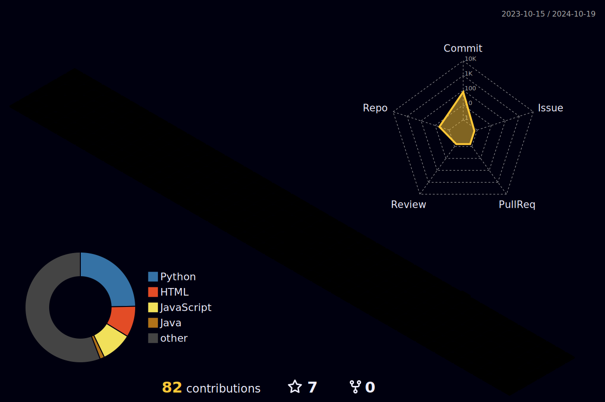

  

  
  

  
 |  |  |  
 | ----------- | ----------- |

 
  

   <h1 style="display: inline-flex; align-items: center; margin: 0;">
  Learning:
  
</h1>

  

 
##
   

     
  

  
 

 
  
  

  

